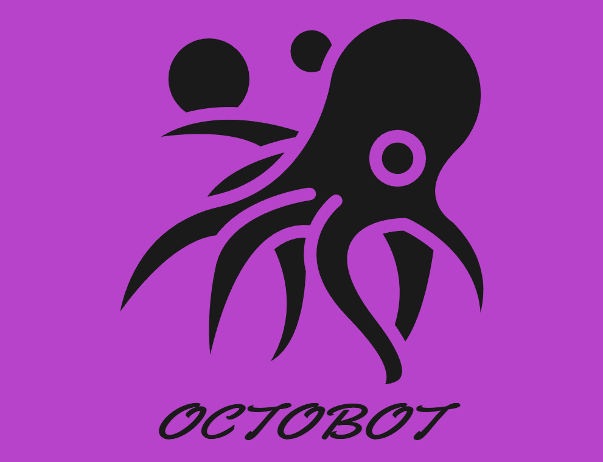

# OctoBot

Have you ever wished to escape all the simple light and dark themes you see? It's not just on other AI chatbot websites, it's on <i> most </i> websites these days. 
Well, wish no more, for OctoBot is here! OctoBot allows you to choose from themes with actual color in it, making it more interesting and fun to use. Plus, the themes are actually
<i> packs </i> of color, meaning that it consists of many colors that you will see throughout the website. You also have a variety of font-families to choose from to use on the 
website. OctoBot is entirely locally stored and hosted, which means you don't have to worry about the privacy of your conversations. It's also open source on GitHub, so feel free to modify and tweak anything you want! So, what are you waiting for? Start chatting with Octobot right now!
 

The demonstration on YouTube is out!: https://www.youtube.com/watch?v=7iqarLuCMQ8&t=5s

